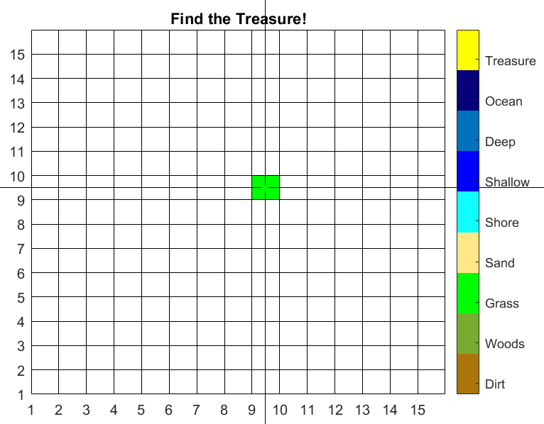
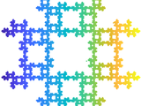

# Treasure Hunt Game: Learn to Code

 or 

**Curriculum Module**

_Created with R2022b. Compatible with R2022b and later releases._

# Information

This curriculum module contains interactive [MATLAB® live scripts](https://www.mathworks.com/products/matlab/live-editor.html) that teach fundamental concepts and basic terminology related to programming through the development of an interactive treasure hunting game.

## Background

You can use these live scripts as demonstrations in lectures, class activities, or interactive assignments outside class. This module covers topics such as variables, matrices, conditional statements, strings, arrays, indexing and functions.

## Contact Us

Solutions are available upon instructor request. Contact the [MathWorks teaching resources team](mailto:onlineteaching@mathworks.com) if you would like to request solutions, provide feedback, or if you have a question.

## Prerequisites

This module assumes an ability to identify and plot X,Y points on a grid. It is also intended for those who have an understanding of basic computer science concepts, such as syntax, variables, and arrays. If you would like more practice with these concepts, we recommend trying the set of exercises in [Fundamentals of Programming](https://www.mathworks.com/matlabcentral/fileexchange/103225-fundamentals-of-programming).

## Getting Started
### Accessing the Module
### **On MATLAB Online:**

Use the  link to download the module. You will be prompted to log in or create a MathWorks account. The project will be loaded, and you will see an app with several navigation options to get you started.

### **On Desktop:**

Download or clone this repository. Open MATLAB, navigate to the folder containing these scripts and double-click on [TreasureHunt.prj](TreasureHunt.prj). It will add the appropriate files to your MATLAB path and open an app that asks you where you would like to start. 

Ensure you have all the required products ([listed below](#H_E850B4FF)) installed. If you need to include a product, add it using the Add-On Explorer. To install an add-on, go to the **Home** tab and select   **Add-Ons** > **Get Add-Ons**. 

## Products

MATLAB® is used throughout.

# Scripts

*If you are viewing this in a version of MATLAB prior to R2023b, you can view the learning outcomes for each script* [*here*](https://www.mathworks.com/matlabcentral/fileexchange/123265-treasure-hunt)

## [**TreasureHuntLearn.mlx**](Scripts/TreasureHuntLearn.mlx)
|  | **In this script, students will...**  -  Create and modify variables  -  Create and modify colorful plots  -  Design and program an interactive game | **Academic disciplines**  -  Programming  -  Basic algebra  |
| :-- | :-- | :-- |

## [**TreasureHuntPlay.mlx**](Scripts/TreasureHuntPlay.mlx)
|  | **In this script, students will...**  -  Use the code they wrote in TreasureHuntLearn.mlx to put together a playable treasure hunting game! | **Academic disciplines**  -  Programming  -  Basic algebra  |
| :-- | :-- | :-- |

## [**TreasureHuntAdvanced.mlx**](Scripts/TreasureHuntAdvanced.mlx)
|  | **In this script, students will...**  -  Play a new version of the game they created in TreasureHuntPlay.mlx where the player can input their guess by clicking on the desired square | **Academic disciplines**  -  Programming  -  Basic algebra  |
| :-- | :-- | :-- |

# Related Courseware Modules

## [Fundamentals of Programming](https://www.mathworks.com/matlabcentral/fileexchange/103225-fundamentals-of-programming)
|  | **Available on:**[GitHub](https://github.com/MathWorks-Teaching-Resources/Fundamentals-of-Programming)  |
| :-- | :-- |

## [Programming: Structuring Code](https://www.mathworks.com/matlabcentral/fileexchange/115905-programming-structuring-code)
|  | **Available on:**[GitHub](https://github.com/MathWorks-Teaching-Resources/Programming-Structuring-Code)  |
| :-- | :-- |

## [Programming: Organizing Data](https://www.mathworks.com/matlabcentral/fileexchange/115900-programming-organizing-data)
|  | **Available on:**[GitHub](https://github.com/MathWorks-Teaching-Resources/Programming-Organizing-Data)  |
| :-- | :-- |

Or feel free to explore our other [modular courseware content](https://www.mathworks.com/matlabcentral/fileexchange/?q=tag%3A%22courseware+module%22&sort=downloads_desc_30d).

# Educator Resources
-  [Educator Page](https://www.mathworks.com/academia/educators.html) 

Copyright 2023 The MathWorks™, Inc

